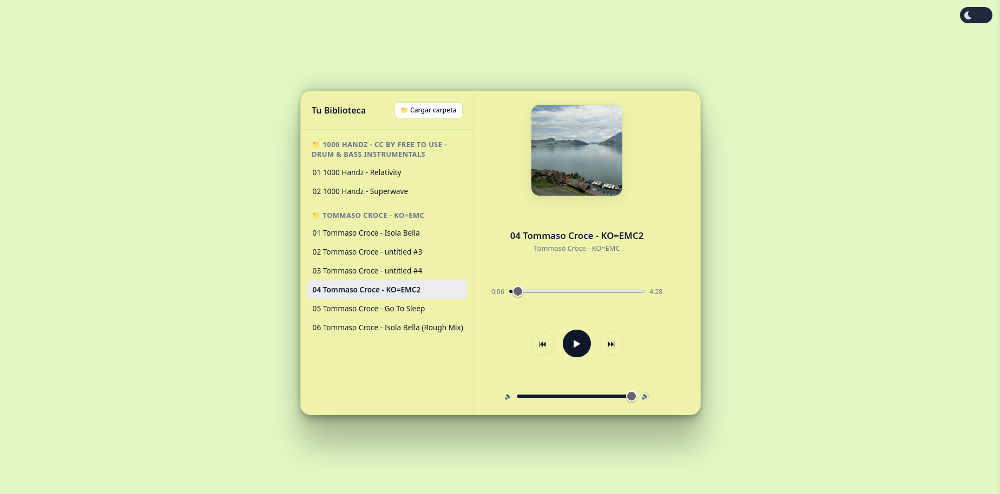
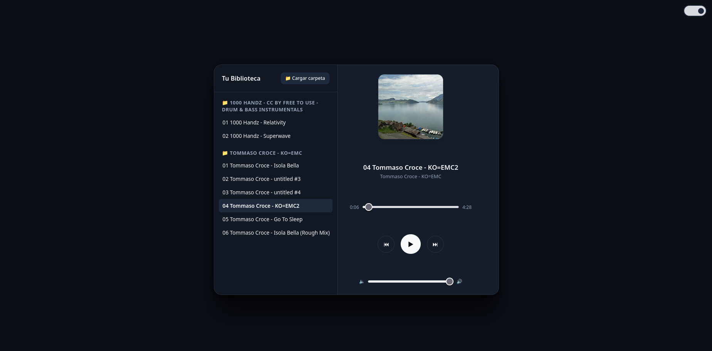
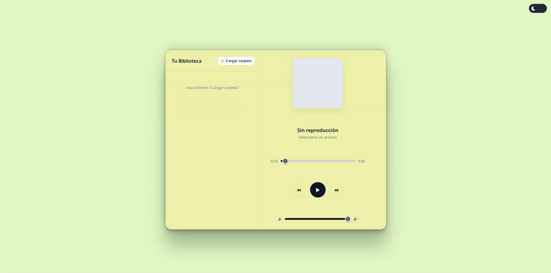

# 🎵 rarroy Player

<!-- Aquí puedes añadir badges (insignias). Generan muy buena impresión. -->

> A sleek, minimalist, and fully functional local music player built directly in the browser.

Welcome to **rarroy Player**! This is my first professional-grade frontend project, designed to explore DOM manipulation, Web APIs, and modern UI/UX design without relying on heavy frameworks.

  
    
  
    
  

## ✨ Features (Current & Upcoming)

- 📂 **Local Audio Playback:** Load your music seamlessly from your local storage.
- 🎨 **Modern UI:** Clean interface with a built-in Dark/Light mode toggle.
- ⌨️ **Keyboard Shortcuts:** Control playback and volume without touching the mouse.
- 🏷️ **ID3 Metadata:** Automatic extraction of real track titles, artists, and cover art.
- 🚧 *(Coming Soon)* Dynamic Drag & Drop queue.
- 🚧 *(Coming Soon)* Adaptive colors based on album art.
- 🚧 *(Coming Soon)* Real-time search and filtering.

## 🛠️ Built With

- **HTML5 & CSS3:** For the structure and responsive styling (Grid/Flexbox).
- **Vanilla JavaScript:** Core logic and audio engine control.
- **[jsmediatags](https://github.com/aadsm/jsmediatags):** For reading ID3 tags from MP3 files.

## 🚀 How to Use

- Open the web app and click "📁 Cargar" to select your local music directory.
- Your tracks will automatically appear organized by folders and albums.
- Click on any song to start playback.
- Control playback using either the on-screen UI buttons or keyboard shortcuts (Space, Arrow keys).

## 👨‍💻 About Me

I'm **Raúl**, an undergraduate student pursuing a degree in Computer Engineering at Universidad de Castilla-La Mancha. I'm passionate about software development, systems architecture, and building cool projects from scratch. 

You can find more about me and my other projects at [rarroy.dev](https://rarroy.dev).

## 🙏 Credits & Demo Music

The demo audio tracks and artwork featured in the previews are used in accordance with their respective Creative Commons licenses:

* **FREE TO USE - Drum & Bass Instrumentals**
  * **Artist:** 1000 Handz
  * **Source:** [Free Music Archive](https://freemusicarchive.org/)
  * **License:** Creative Commons Attribution (CC BY 4.0)

* **KO=EMC**
  * **Artist:** Tommaso Croce
  * **Source:** [Free Music Archive](https://freemusicarchive.org/)
  * **License:** Creative Commons Attribution (CC BY 4.0)

## 📄 License

Distributed under the MIT License. See `LICENSE` for more information.
